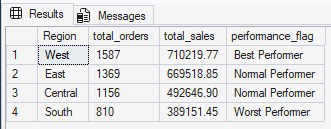
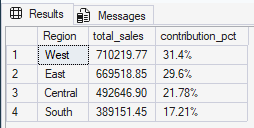
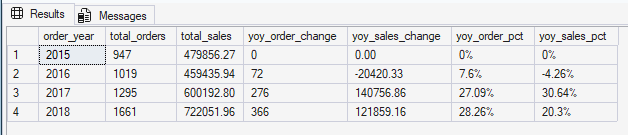

# 📊 SQL Superstore Sales Analysis

---

## 🔍 Problem
The business lacked visibility into regional performance, product contribution, and growth trends, making it difficult to take data-driven decisions.

---

## 📊 Dataset
- Superstore dataset  
- 4,922 orders  
- $2.26M total sales  

---

## 🧠 Analysis Performed
- Identified top and underperforming regions
- Category and product-level analysis  
- Sales trend analysis (year-wise)  
- Revenue vs order volume comparison  

## 📊 Region Performance Analysis

## 📊 Regional Contribution (%)

## 📊 YoY Sales Trend Analysis

---

## 📊 Key Insights

- **West region leads (31.4%)** — strong and mature market  
- **South underperforms (17.2%)** — demand-side issue (low orders)  
- **Technology category = highest revenue per order**  
- **Office Supplies = high volume but low value**  
- **Sales dropped in 2016 (-4.26%)**, then recovered  
- **Growth is becoming volume-driven** → risk to AOV  
- **Revenue concentrated among few customers** → dependency risk  

---

## 🏆 Product-Level Insights

- High-value products (copiers, printers) drive revenue  
- Low-value items (staples, paper) drive order volume  
- Clear gap between **revenue drivers vs volume drivers**

---

## 💡 Business Impact

- Increase focus on South region to improve order volume
- Promote Technology category to maximize revenue per order
- Reduce dependency on top customers to minimize risk 

---

## 🛠 Tools Used
SQL | Excel  

---

## 🚀 Conclusion
This project highlights how SQL can be used not just for querying data, but for deriving meaningful business insights and supporting strategic decisions.

📂 Full SQL queries with detailed analysis are available in the [`/queries`](queries/) folder.
